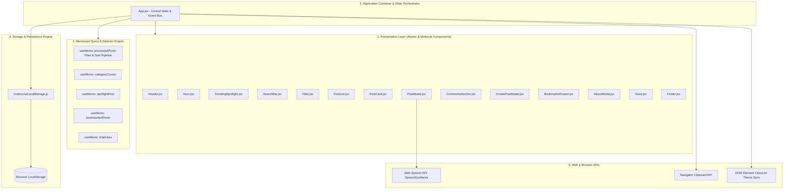
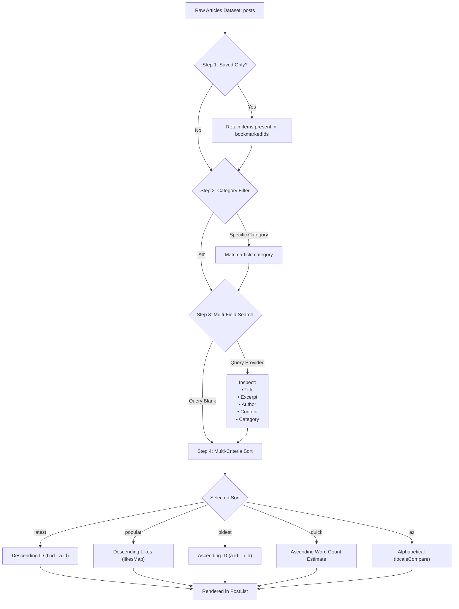

# React Blog UI 🚀

[](https://react.dev/)
[](https://vitejs.dev/)
[](https://tailwindcss.com/)
[](https://opensource.org/licenses/MIT)
[](https://github.com/)

A state-of-the-art, high-performance, and fully responsive **React JS Blog Application & Content Platform** built with **Vite**, **React 19**, **Tailwind CSS v4**, and local persistent storage.

---

## 🌟 Project Overview

### Executive Summary
**React Blog UI** is a production-grade single-page application (SPA) designed to deliver a modern, fluid, and immersive reading experience. Engineered with zero external backend or cloud database dependencies, the application harnesses the power of modern client-side React 19 paradigms, custom persistence hooks, memoized query selectors, and native browser Web APIs to provide a seamless, lightning-fast content hub.

Whether used as a portfolio centerpiece, an interactive reading portal, or a reference architecture for modern frontend patterns, React Blog UI demonstrates how to build rich, scalable user interfaces while maintaining uncompromising performance and aesthetic elegance.

### Why This Project?
- **Zero-Latency Client-Side Performance**: Instant search, category filtration, and multi-criteria sorting execute in sub-millisecond time with zero round-trip server latency.
- **Offline-First Resilience**: All published articles, bookmarks, likes, comments, and theme preferences synchronize automatically to the browser's `localStorage`.
- **Production-Ready Component Design**: Built with clean, reusable, decoupled components adhering strictly to unidirectional data flow and presentation/container patterns.
- **Rich Browser Integration**: Features native **Text-to-Speech audio narration** via the Web Speech API, smart deep-link sharing via the Clipboard API, and instant dark/light theme switching.

### Comprehensive Feature Matrix

```
┌──────────────────────────────────────────────────────────────────────────────┐
│                              REACT BLOG UI                                   │
└──────────────────────────────────────────────────────────────────────────────┘
  ├── 🔍 Content Discovery & Search
  │   ├── Instant, real-time multi-field search (Title, Excerpt, Author, Content, Category)
  │   ├── Dynamic category pills with live article count badges
  │   ├── Multi-criteria sorting (Popularity, Latest, Oldest, Quick Read, Alphabetical)
  │   ├── Layout toggling (Fluid 3/2/1 Responsive Grid vs Condensed List View)
  │   └── Quick "/" keyboard shortcut to focus the search bar from anywhere
  │
  ├── 📖 Immersive Article Reader Modal
  │   ├── Focus-trapped, backdrop-blurred modal dialog (ESC key & backdrop dismiss)
  │   ├── Real-time scroll depth reading progress bar
  │   ├── Text-to-Speech (Web Speech API) audio player with Play, Pause, and Stop
  │   ├── Dynamic font size scaling (A- / A / A+) for accessibility
  │   ├── Calculated reading time estimates & rich author attribution
  │   └── Deep-linked article sharing with automatic clipboard copy
  │
  ├── ✍️ In-Browser Article Authoring Studio
  │   ├── Client-side "Write Article" modal dialog
  │   ├── Real-time split-screen card preview as you type
  │   ├── Unsplash image URL validation & category tag selection
  │   └── Instant publication with persistent storage synchronization
  │
  ├── 🔖 Personalization & Community Engagement
  │   ├── Slide-over "Saved Articles" / Bookmarks drawer with badge counter
  │   ├── Interactive Like system with count persistence and heart micro-animations
  │   ├── Interactive Commenting board per article with relative timestamps & deletion
  │   └── Featured "Trending Spotlight" banner calculated dynamically by highest engagement
  │
  └── 🎨 UX Ergonomics & Design
      ├── Dark / Light theme engine with persistent state sync
      ├── Non-blocking floating Toast notifications for all user actions
      ├── Responsive mobile drawer navigation menu
      └── Interactive "About Developer" and "Contact Us" modal dialogs
```

---

## 🏗️ Project Architecture

For an exhaustive engineering breakdown including component contracts and migration blueprints, see the companion [ARCHITECTURE.md](file:///c:/Users/garai/OneDrive/Documents/React_Blog_UI/ARCHITECTURE.md).

### 1. High-Level Architectural Topology

The application is structured into five distinct, decoupled architectural layers:



---

### 2. Component Hierarchy & Communication Tree

The tree diagram below illustrates the parent-to-child component nesting and modal portals:

```mermaid
graph TD
    App["App.jsx (Root Application Controller)"]
    
    %% Direct Layout Children
    App --> Header["Header.jsx (Sticky Navbar & Mobile Drawer)"]
    App --> Hero["Hero.jsx (Welcome Banner & Live Metric Counters)"]
    App --> TrendingSpotlight["TrendingSpotlight.jsx (Highest-Liked Article Banner)"]
    App --> SearchBar["SearchBar.jsx (Keyboard Shortcut & Input)"]
    App --> Filter["Filter.jsx (Category Pills, Sorters & View Switcher)"]
    App --> PostList["PostList.jsx (Grid / List Layout Container)"]
    App --> Footer["Footer.jsx (Navigation Links & Newsletter)"]

    %% Repeated Child Cards
    PostList --> PostCard["PostCard.jsx (Article Card Molecule)"]

    %% Overlays, Drawers & Modals
    App -.-> PostModal["PostModal.jsx (Full Reader with Text-to-Speech)"]
    PostModal --> CommentsSection["CommentsSection.jsx (Article Discussion Feed)"]
    App -.-> BookmarksDrawer["BookmarksDrawer.jsx (Slide-over Reading List)"]
    App -.-> CreatePostModal["CreatePostModal.jsx (Live-Preview Publishing Studio)"]
    App -.-> AboutModal["AboutModal.jsx (About & Contact Dialogs)"]
    App -.-> Toast["Toast.jsx (Floating Feedback Snackbar)"]

    classDef root fill:#1e1e38,stroke:#6366f1,stroke-width:2px,color:#fff;
    classDef layout fill:#0f172a,stroke:#38bdf8,stroke-width:1.5px,color:#fff;
    classDef overlay fill:#1e293b,stroke:#a855f7,stroke-width:1.5px,stroke-dasharray: 4 4,color:#fff;

    class App root;
    class Header,Hero,TrendingSpotlight,SearchBar,Filter,PostList,PostCard,Footer,CommentsSection layout;
    class PostModal,BookmarksDrawer,CreatePostModal,AboutModal,Toast overlay;
```



---

### 3. Data Processing & Filter Pipeline

The application features a non-destructive, single-pass filtering and sorting engine computed via `useMemo`. When any search term, category pill, or sort option changes, the dataset passes through this pipeline:



---

### 4. State Management Architecture

The application adopts a clean, three-tier state management paradigm:

| State Tier | Implementation | Scope | Key Variables |
| :--- | :--- | :--- | :--- |
| **Persistent Domain State** | `useLocalStorage` Custom Hook | Global Application | `posts`, `bookmarkedIds`, `userLikedIds`, `likesMap`, `comments`, `theme` |
| **Volatile View State** | Standard `useState` | Container (`App.jsx`) | `searchTerm`, `selectedCategory`, `sortBy`, `viewMode`, `showSavedOnly`, `selectedPost`, modal visibility toggles |
| **Transient UI State** | Local `useState` & `useRef` | Child Components | Modal scroll depth, audio narration playback state, font size selection, comment drafts |

---

## 📂 Project Folder Structure

```
React_Blog_UI/
├── public/
│   └── favicon.svg               # Application browser favicon
├── src/
│   ├── components/
│   │   ├── AboutModal.jsx        # Tabbed About & Contact modal dialogs
│   │   ├── BookmarksDrawer.jsx   # Slide-over saved reading list drawer
│   │   ├── CommentsSection.jsx   # Interactive comment feed with author avatars
│   │   ├── CreatePostModal.jsx   # Article publishing studio with live card preview
│   │   ├── Filter.jsx            # Category pills, sort controls, and layout toggle
│   │   ├── Footer.jsx            # Footer with category navigation and newsletter
│   │   ├── Header.jsx            # Responsive navigation bar and mobile drawer menu
│   │   ├── Hero.jsx              # Hero banner with live metrics and demo reset
│   │   ├── PostCard.jsx          # Reusable article card (Grid and List modes)
│   │   ├── PostList.jsx          # Responsive card grid / list and empty state handler
│   │   ├── PostModal.jsx         # Full reader with scroll progress & Text-to-Speech
│   │   ├── SearchBar.jsx         # Real-time search with "/" keyboard shortcut
│   │   ├── Toast.jsx             # Floating notification banner with auto-dismiss
│   │   └── TrendingSpotlight.jsx # Featured banner displaying highest-engagement post
│   ├── data/
│   │   └── posts.json            # Curated seed database with 10 technical articles
│   ├── hooks/
│   │   └── useLocalStorage.js    # Custom persistent storage synchronization hook
│   ├── App.css                   # Custom global animations and scrollbar rules
│   ├── App.jsx                   # Central state orchestrator and event hub
│   ├── index.css                 # Tailwind CSS v4 directives & theme configurations
│   └── main.jsx                  # React 19 application entry point
├── ARCHITECTURE.md               # Deep-dive system architecture specification
├── index.html                    # HTML5 entry document with web fonts & SEO meta tags
├── package.json                  # Dependencies, build scripts & metadata
├── vite.config.js                # Vite 8 build configuration with Tailwind CSS plugin
└── README.md                     # Comprehensive project documentation
```

---

## 🧠 React 19 Concepts Demonstrated

| Concept | File Location | Description & Implementation |
| :--- | :--- | :--- |
| **Functional Components** | All `src/components/*.jsx` | Modular, single-responsibility, highly composable presentation units. |
| **Unidirectional Props** | All Components | Strict parent-to-child data distribution and callback-based event bubbling. |
| **Custom Hooks** | `src/hooks/useLocalStorage.js` | Abstracted localStorage synchronization with automatic JSON serialization and fallback handling. |
| **`useState` Hook** | `App.jsx`, `PostModal.jsx`, etc. | Local state management for UI states, active modals, and form inputs. |
| **`useMemo` Selectors** | `App.jsx` | Computing derived state (categories, category counts, total likes, filtered/sorted posts, spotlight post) efficiently without redundant recalculations. |
| **`useEffect` Hook** | `App.jsx`, `PostModal.jsx` | Theme DOM class toggling, keyboard event listeners (`Escape`, `/`), and scroll containment. |
| **`useRef` Hook** | `PostModal.jsx`, `SearchBar.jsx` | DOM element reference for calculating scroll depth and focusing the search input. |
| **Web Speech API** | `PostModal.jsx` | `window.SpeechSynthesis` integration for in-browser Text-to-Speech audio reading with lifecycle cleanup. |
| **Clipboard API** | `App.jsx` | `navigator.clipboard.writeText` for copying shareable deep links. |
| **Conditional Rendering** | `App.jsx`, `PostList.jsx` | Dynamically rendering modals, spotlight banner, and the empty state when search produces 0 matches. |

---

## 🛠️ Technologies Used

- **React 19 (`^19.2.8`)** – Latest React release with optimized reconciliation and hooks.
- **Vite 8 (`^8.3.0`)** – Next-generation build tool with sub-second HMR and optimized production bundles.
- **Tailwind CSS v4 (`^4.3.3`)** – Modern utility-first CSS framework via `@tailwindcss/vite`.
- **JavaScript (ES2024)** – Modern syntax (destructuring, arrow functions, Array methods, optional chaining, nullish coalescing).
- **Web Speech API** – In-browser voice narration without external third-party speech libraries.
- **LocalStorage API** – Client-side offline data persistence across browser reloads.

---

## 🚀 Getting Started & Installation

### Prerequisites
Ensure you have **Node.js** (v18.0.0 or higher) and **npm** installed:
```bash
node -v
npm -v
```

### 1. Clone or Open the Repository
```bash
cd React_Blog_UI
```

### 2. Install Dependencies
```bash
npm install
```

### 3. Start Development Server
```bash
npm run dev
```
Open your browser at the displayed local URL (typically `http://localhost:5173/`).

### 4. Build for Production
To create an optimized production build in the `dist/` directory:
```bash
npm run build
```

To preview the production build locally:
```bash
npm run preview
```

---

## 📝 Blog Data Specification

Articles stored in `src/data/posts.json` adhere to the following schema:

```json
{
  "id": 1,
  "title": "Mastering React 19: The New Era of Modern Web Development",
  "author": "Alex Rivera",
  "date": "March 12, 2025",
  "category": "React",
  "image": "https://images.unsplash.com/photo-1633356122544-f134324a6cee?q=80&w=800&auto=format&fit=crop",
  "excerpt": "Discover the game-changing features in React 19...",
  "content": "Full multi-paragraph article body content..."
}
```

---

## 🎨 Styling & Design Aesthetics

- **Tailwind CSS v4 Integration**: Rapid, clean utility classes paired with custom gradient overlays.
- **Theme Switching**: Seamless transition between sleek dark theme (`bg-slate-950`) and clean light theme (`bg-slate-50`).
- **Micro-Animations**: Hover zoom effects, pulse glows, heart pop animations, and smooth sliding transitions.
- **Accessibility (a11y)**: Focus management, ARIA labels, semantic HTML tags (`header`, `main`, `article`, `footer`, `time`), and keyboard navigation.

---

## 📄 License

This project is licensed under the **MIT License** — open-source and free to use for educational, personal, and commercial projects.
